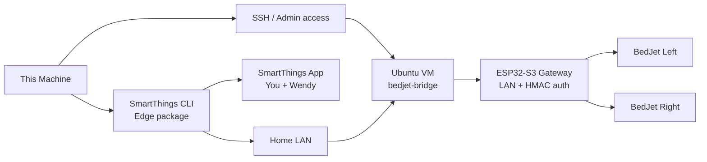

# BedJet SmartThings Bridge

Private home-use BedJet control stack with an `ESP32-S3` gateway, a Dockerized Ubuntu VM bridge service, and a `SmartThings Hub` Edge LAN driver.

## Current Status

- `Implemented`: script-first remote setup, concise local setup wizard, remote install artifacts, runnable bridge service, ESP32 firmware scaffold, SmartThings Edge scaffold, and setup docs.
- `Fake run available`: the wizard can simulate the end-to-end setup flow without touching SSH, Docker, firmware, bridge, or SmartThings.
- `Script-first path available`: Windows PowerShell scripts now prove SSH, remote LAN reachability, gateway claim, Docker, remote deploy, and bridge health/status before we depend on the wizard.
- `LAN-first runtime`: SmartThings is expected to reach the bridge over the home LAN, not over Tailscale.
- `Gateway claim scaffolded`: bridge-to-gateway claim status, claim, and signed-request hooks now exist in code.
- `Gateway local admin page live`: the firmware now supports AP-based Wi‑Fi onboarding at `http://192.168.4.1` and a station-mode admin page at `http://bedjet-gateway.local/`.
- `Validated in this workspace`: `node --test` passes under both `bridge/` and `setup-app/`, and both servers import cleanly.
- `BLE backend implemented`: the ESP firmware now scans and connects over BLE directly instead of using the simulator.
- `Not hardware-validated yet`: real BedJet BLE packet/control behavior against the physical BedJet units and SmartThings hub discovery/install on your hub.

## Repo Layout

```text
bedjet-smartthings-bridge/
├── README.md
├── PLAN.md
├── deploy/
├── docs/
├── bridge/
├── firmware/
├── mock-gateway/
├── setup-app/
└── smartthings-edge/
```

## Architecture



## Setup Flow

### Script First

Use the Windows PowerShell script when you want the smallest reliable path first:

```powershell
powershell -ExecutionPolicy Bypass -File D:\Dev\bedjet-smartthings-bridge\scripts\windows\Setup-BedJetBridge.ps1
```

Default target is `<ssh-target>`. The script walks these steps:

1. local prerequisite checks
2. SSH batch-mode verification
3. remote host LAN and Docker verification
4. local gateway discovery
5. gateway claim and signed-request verification
6. bridge bundle deploy
7. remote bridge health check
8. remote bridge-to-gateway integration verification

It stops on the first real failure.

The script saves rerun state in `data/setup-state.json` so the gateway URL, gateway ID, shared secret, and bridge LAN URL can be reused.

Before the script can reach the gateway, flash the ESP32 and provision Wi‑Fi:

1. power the ESP32
2. join `BedJetGatewaySetup`
3. open [http://192.168.4.1](http://192.168.4.1)
4. save SSID, password, and hostname
5. wait for the gateway to reboot onto your LAN

Once the gateway is on Wi‑Fi, open the ESP admin page:

```text
http://bedjet-gateway.local/
```

Use it to:

1. confirm network + claim status
2. scan for nearby BedJets
3. assign one unit to `Left`
4. assign one unit to `Right`
5. forget, verify, release BLE, and send simple per-side test commands

Check the deployed bridge later with:

```powershell
powershell -ExecutionPolicy Bypass -File D:\Dev\bedjet-smartthings-bridge\scripts\windows\Get-BedJetBridgeStatus.ps1
```

Update gateway firmware remotely (HMAC-signed + SHA256-verified):

```powershell
powershell -ExecutionPolicy Bypass -File D:\Dev\bedjet-smartthings-bridge\scripts\windows\Update-BedJetGatewayFirmware.ps1
```

### Dry Run

Use the mock gateway when you want to dry-run the claim/auth and bridge wiring before the real ESP32 is flashed:

```bash
cd /mnt/d/Dev/bedjet-smartthings-bridge/mock-gateway
node src/server.mjs
```

Then point the setup script at it:

```powershell
powershell -ExecutionPolicy Bypass -File D:\Dev\bedjet-smartthings-bridge\scripts\windows\Setup-BedJetBridge.ps1 -GatewayBaseUrl http://127.0.0.1:8789
```

For a local-only dry run of gateway discovery, claim, and signed verification without the VM leg:

```powershell
powershell -ExecutionPolicy Bypass -File D:\Dev\bedjet-smartthings-bridge\scripts\windows\Setup-BedJetBridge.ps1 -GatewayBaseUrl http://127.0.0.1:8789 -SkipRemote
```

For a full remote bridge dry run, the mock gateway must be reachable from both your Windows machine and the bridge VM.

### Wizard

1. The current preferred path is the Windows PowerShell setup script.
2. The local wizard remains in the repo, but it is secondary until rebuilt on top of the script-first flow.

## Debug Mode

The setup wizard has an explicit debug mode and it defaults to `on` right now.
It also has a `fake run` mode you can enable from the first card to rehearse the entire flow before the hardware arrives.

Debug mode shows:

- current step and sub-step
- raw SSH/CLI commands
- stdout/stderr streams
- bridge HTTP calls
- health checks and timing
- saved debug bundle output

It is verbose, not read-only: commands still execute unless a step explicitly offers a safe probe.

## Setup-App Quick Start

### Local

```bash
cd /mnt/d/Dev/bedjet-smartthings-bridge/setup-app
node src/server.mjs
```

Open [http://127.0.0.1:8890](http://127.0.0.1:8890) if it does not auto-open.

### Main Endpoints

- `GET /api/setup/session`
- `PUT /api/setup/session`
- `POST /api/setup/step/:stepId/prepare`
- `POST /api/setup/step/:stepId/permission`
- `POST /api/setup/step/:stepId/run`
- `POST /api/setup/step/:stepId/verify`
- `POST /api/setup/ssh-discovery/scan`
- `POST /api/setup/bridge-target/select`
- `POST /api/setup/mock-mode/enable`
- `POST /api/setup/handoff`
- `GET /api/setup/debug/events`
- `GET /api/setup/debug/bundle`

## Bridge Runtime Flow

The SmartThings hub does not talk BLE to BedJet directly. It runs an Edge LAN driver that:

- calls the bridge over local HTTP
- exposes left/right devices inside SmartThings
- supports routines and household access
- keeps normal app control local to your LAN

The bridge remains the source of truth for pairing, schedules, Nightly Bio profiles, and firmware coordination.

## Security Model

- SmartThings talks only to the bridge.
- The bridge talks to the gateway over the home LAN.
- The bridge and gateway use a claim + signed-request model.
- The setup script writes the shared secret into the remote bridge env file and saves it locally for reruns.
- Saved gateway credentials are only reused when the setup script is pointed at the same gateway URL; dry-run state will not be reused against a different device.
- `Tailscale` is optional for admin access only and is not required for normal SmartThings operation.

## Bridge Runtime Quick Start

### Local

```bash
cd /mnt/d/Dev/bedjet-smartthings-bridge/bridge
node src/server.mjs
```

Open [http://127.0.0.1:8787](http://127.0.0.1:8787).

### Environment

Copy [bridge/.env.example](/mnt/d/Dev/bedjet-smartthings-bridge/bridge/.env.example) to `.env` if you want overrides.

Key settings:

- `PORT`: HTTP port, default `8787`
- `TIMEZONE`: schedule timezone, default `America/Los_Angeles`
- `FIRMWARE_API_BASE_URL`: ESP32 gateway base URL, default `http://bedjet-gateway.local`
- `FIRMWARE_GATEWAY_ID`: bridge identity presented to the gateway
- `FIRMWARE_SHARED_SECRET`: shared secret used for HMAC request signing
- `SIMULATE_FIRMWARE`: `true` uses the built-in simulator until BLE is ready
- `DATA_PATH`: SQLite file path, default `bridge/data/bridge.sqlite`

### Docker

```bash
cd /mnt/d/Dev/bedjet-smartthings-bridge/bridge
docker build -t bedjet-bridge .
docker run --rm -p 8787:8787 \
  -e FIRMWARE_API_BASE_URL=http://bedjet-gateway.local \
  -v $(pwd)/data:/app/data \
  bedjet-bridge
```

## Firmware Quick Start

The firmware scaffold lives under [firmware/](/mnt/d/Dev/bedjet-smartthings-bridge/firmware). It now exposes:

- a local ESP admin page for Wi‑Fi setup and left/right pairing management
- signed bridge-facing APIs under `/api/v1/*`
- local human-facing admin APIs under `/api/v1/local/*`

The pairing/control state machine is in place and the firmware now uses a real BLE transport path. It still needs validation against the physical BedJet units for scan, pair, verify, and command behavior.

If PlatformIO is installed:

```bash
cd /mnt/d/Dev/bedjet-smartthings-bridge/firmware
pio run
```

## SmartThings Quick Start

The Edge package scaffold lives under [smartthings-edge/](/mnt/d/Dev/bedjet-smartthings-bridge/smartthings-edge).

Useful docs:

- [docs/smartthings-cli.md](/mnt/d/Dev/bedjet-smartthings-bridge/docs/smartthings-cli.md)
- [smartthings-edge/README.md](/mnt/d/Dev/bedjet-smartthings-bridge/smartthings-edge/README.md)

Typical flow:

1. Package the driver with the CLI.
2. Create or reuse a private channel.
3. Assign the driver to the channel.
4. Enroll your hub in the channel.
5. Install the driver onto the hub.

The initial driver surface intentionally stays conservative:

- `BedJet Left` and `BedJet Right` expose power, fan level, refresh, and current temperature
- `Left Nightly Bio` and `Right Nightly Bio` act as launcher switches
- richer BedJet-specific mode and target-temperature controls remain bridge-native until the driver is validated on hardware

## Operator Actions

- `Local checks`: verify the tools and hardware visibility on this machine.
- `SSH discovery`: ask permission first, then show saved hosts and active SSH/tunnel sessions.
- `Target selection`: explicitly choose a host or enter one manually before any remote work starts.
- `Docker precheck`: verify Docker and `docker compose`; if needed, approve one repair action at a time.
- `Bridge install`: package and deploy the bridge to the Ubuntu VM over SSH.
- `Build + flash`: try the ESP32 upload path or surface exact fallback instructions.
- `Pairing`: choose one explicit action at a time and verify left and right independently.
- `Generate handoff`: write a Codex-ready markdown handoff when direct automation is blocked.

## References

- [docs/setup-wizard.md](/mnt/d/Dev/bedjet-smartthings-bridge/docs/setup-wizard.md)
- [docs/protocol-notes.md](/mnt/d/Dev/bedjet-smartthings-bridge/docs/protocol-notes.md)
- [docs/onboarding.md](/mnt/d/Dev/bedjet-smartthings-bridge/docs/onboarding.md)
- [docs/troubleshooting.md](/mnt/d/Dev/bedjet-smartthings-bridge/docs/troubleshooting.md)
- [docs/e2e-session-runbook.md](/mnt/d/Dev/bedjet-smartthings-bridge/docs/e2e-session-runbook.md)
