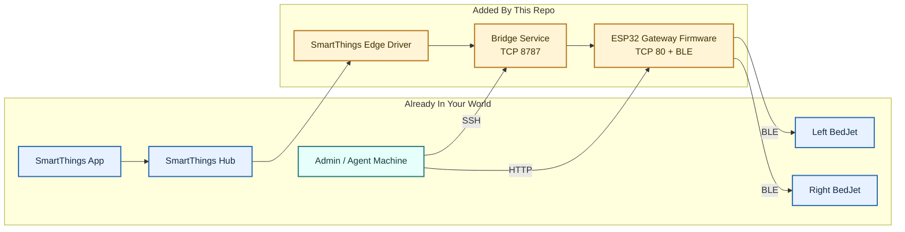

# BedJet SmartThings Bridge

## What It Is

This project connects two BedJet units to SmartThings with:

1. A gateway that talks to your BedJet through Bluetooth. This is the `ESP32-S3 Gateway`.
2. A bridge that connects the gateway to SmartThings. This is our `Bridge Service` that runs on a Linux host (Docker).
3. An Edge driver so SmartThings knows how to talk to the bridge. This is our `SmartThings Edge Driver` that is installed on to your ST hub.

Think of it as a translator stack: SmartThings speaks LAN, BedJet speaks BLE, and the bridge keeps everyone from arguing about state.

What it does:

- Controls up to two BedJet units from SmartThings.
- Keeps SmartThings state tied to actual BedJet readback instead of wishful thinking.
- Gives you a local gateway UI for pairing, checks, Wi-Fi maintenance, indicator control, and OTA updates.

## Highlights

- Local-first: the running system stays on your network. No cloud relay and no SSH tunnel acrobatics required for normal operation.
- Security-minded: explicit gateway claim, signed maintenance actions, OTA attestation, rollback support, and no baked-in personal endpoints.
- Easy to install: agent-first instructions, Windows helper scripts, and a full manual fallback when you want to see every moving part.
- Honest state: SmartThings commands are designed around confirmed BedJet readback, not optimistic UI theater.
- Maintainable: pairing, Wi-Fi maintenance, activity light control, health checks, version checks, and OTA updates are all built into the stack.
- Portable control: you can run the install flow from Windows, Linux, or macOS as long as you can reach SSH and the local gateway.



## What You Need To Start

- A Linux host reachable over SSH (for the bridge).
- Docker + Compose on that Linux host.
- An ESP32-S3 module that can run this firmware.
- PlatformIO Core (`pio`) on the machine used to flash the ESP32.
- SmartThings hub + SmartThings CLI access.
- Control machine (Windows/Linux/macOS) that can reach:
  - bridge host over SSH
  - gateway on LAN HTTP
- Node.js `>=24` (for local tests/tools).

## Install Order

Run it in this order:

1. Provision gateway on Wi-Fi.
2. Install and verify bridge.
3. Pair left and right BedJets.
4. Install SmartThings Edge driver.
5. Verify end-to-end control.

Do not shuffle that order unless you enjoy debugging Bluetooth and networking at the same time.

## Agent Instructions (Primary Install Path)

The fastest and easiest install is agent first: With Codex, OpenClaw, Claude, or similar type the following:
```text
Please install this project for me: https://github.com/bedjet-smartthings-bridge
```
Read the README fully and follow it in order.
Ask only for missing values: repo-root, ssh-target, gateway-url.
Do not assume SSH tunnels.
Stop on first failure with the exact command, stderr, and the fix.
Do not print or commit secrets.


## Connectivity Requirements (Must Be True)

- `SmartThings Hub -> Bridge`: hub can reach bridge LAN URL/port (default `8787`).
- `Bridge -> Gateway`: bridge host can reach `<gateway-url>` over LAN.
- `Gateway -> BedJet`: gateway is in BLE range of both units.
- `Control machine -> Bridge host`: SSH works to `<ssh-target>`.
- `Control machine -> Gateway`: can load gateway web/API for setup and checks.
- `Bridge host + SmartThings Hub + Gateway`: same LAN or routed network with those ports explicitly allowed.

## ESP Bounds (Important Limits)

- Flash layout expects an `8 MB` ESP32-S3 with OTA partitioning.
- OTA app slot size: `3,342,336 bytes` each (`~3.19 MiB`) for `app0` and `app1`.
- SPIFFS size: `1,572,864 bytes` (`1.5 MiB`).
- NVS size: `20 KiB`.
- OTA metadata size: `8 KiB`.
- Core dump partition: `64 KiB`.
- HTTP server port: `80`.
- Setup AP SSID: `BedJetGatewaySetup`.
- SmartThings poll interval:
  - default `15s`
  - minimum `5s`
  - maximum `120s`
- BLE scan duration per scan request: `4s`.
- Pairing model: exactly `2` logical BedJet slots, `left` and `right`.
- Local admin command bounds:
  - `fanStep`: `1-20`
  - `targetTemperatureC`: `15-40`

If your firmware binary grows past the OTA app slot limit, OTA will stop being fun very quickly.

## Lockdown Guidance (No Secret Published)

### Required Ports

- `Bridge host TCP 22` (SSH): admin/control machines only.
- `Bridge host TCP 8787` (bridge API): SmartThings hub + optional admin only.
- `Gateway TCP 80` (gateway UI/API): bridge host + optional admin only.

### Security Rules

1. Default-deny inbound; allow-list only required source IPs.
2. Do not expose bridge `8787` or gateway `80` to WAN.
3. Keep secrets out of git:
   - `FIRMWARE_SHARED_SECRET`
   - `gatewaySharedSecret`
4. Rotate claim/secret if exposure is suspected.

### Example UFW Baseline (Bridge Host)

```bash
sudo ufw default deny incoming
sudo ufw default allow outgoing
sudo ufw allow from <admin-ip-or-cidr> to any port 22 proto tcp
sudo ufw allow from <smartthings-hub-ip> to any port 8787 proto tcp
sudo ufw allow from <admin-ip-or-cidr> to any port 8787 proto tcp
sudo ufw enable
sudo ufw status verbose
```

## End-to-End Manual Flow (Fallback)

### Step 1: Gateway Provisioning (ESP32)

1. Install PlatformIO Core on the machine that will flash the ESP32.

```bash
python -m pip install platformio
```

2. Connect the ESP32-S3 over USB.
3. Flash the firmware. Choose one path.

Windows helper, with optional Wi-Fi preseed so first boot skips the setup AP:

```powershell
powershell -ExecutionPolicy Bypass -File .\scripts\windows\Flash-BedJetGateway.ps1 `
  -Port <com-port> `
  -WifiSsid "<wifi-ssid>" `
  -WifiPassword "<wifi-password>" `
  -GatewayHostname bedjet-gateway
```

Linux/macOS or raw PlatformIO path:

```bash
cd <repo-root>/firmware
pio run -e esp32-s3-devkitc-1 -t upload --upload-port <serial-port>
```

4. If you did not preseed Wi-Fi, join `BedJetGatewaySetup` temporary Wi-Fi AP.
5. Open `http://192.168.4.1`.
6. Save preferred Wi-Fi SSID/password/hostname for gateway LAN operation.
7. Wait for the gateway to reboot onto your normal LAN.
8. Verify network allows bridge host + SmartThings hub to reach gateway.
9. Check `http://bedjet-gateway.local/healthz`.
10. Open `http://bedjet-gateway.local/`.
11. Pair left and right BedJet units:
   - pair left while right is off
   - pair right while left is off
   - verify both after pairing

There is no true network-remote provisioning path before first boot. To skip the AP on day one, preseed Wi-Fi at flash time.
Once the gateway is already claimed and reachable on the LAN, you can rotate Wi-Fi settings remotely with `.\scripts\windows\Set-BedJetGatewayWifi.ps1`. That is a post-install maintenance path, not a first-boot shortcut.
After the gateway is claimed, Wi-Fi changes are treated as a signed maintenance action. That is the security patch in plain English: first boot is easy, later changes are deliberate.

### Step 2: Bridge Install + Verify

Recommended path: use the Windows setup script at least once. It handles gateway claim, secret generation, deploy, and verification in one run.
This is also the step that claims the gateway. After claim, Wi-Fi rotation becomes a signed maintenance action instead of an open first-boot setup action.

Windows (scripted):

```powershell
powershell -ExecutionPolicy Bypass -File .\scripts\windows\Setup-BedJetBridge.ps1 `
  -SshTarget <ssh-target> `
  -GatewayBaseUrl <gateway-url>
```

```powershell
powershell -ExecutionPolicy Bypass -File .\scripts\windows\Get-BedJetBridgeStatus.ps1 `
  -SshTarget <ssh-target>
```

Linux/macOS (manual remote deploy):

If you do not use the Windows setup script, you must claim the gateway yourself first and keep the same ID/secret in the bridge config.

Choose values:

- `<gateway-id>` example: `bedjet-bridge`
- `<gateway-shared-secret>`: random hex string

Claim the gateway once:

```bash
export GATEWAY_URL=<gateway-url>
export GATEWAY_ID=<gateway-id>
export GATEWAY_SHARED_SECRET="$(openssl rand -hex 32)"
curl -fsS -X POST "$GATEWAY_URL/api/v1/claim" \
  -H 'Content-Type: application/json' \
  -d "{\"gatewayId\":\"$GATEWAY_ID\",\"sharedSecret\":\"$GATEWAY_SHARED_SECRET\"}"
```

If the gateway is already claimed, reuse the existing values or reset the gateway before claiming again.

```bash
cd <repo-root>
tar -czf /tmp/bedjet-bridge-bundle.tgz bridge deploy/bridge
ssh <ssh-target> "mkdir -p ~/apps/bedjet-smartthings-bridge"
scp /tmp/bedjet-bridge-bundle.tgz <ssh-target>:~/apps/bedjet-smartthings-bridge/
ssh <ssh-target> "cd ~/apps/bedjet-smartthings-bridge && tar -xzf bedjet-bridge-bundle.tgz && cp -n deploy/bridge/bridge.env.example deploy/bridge/bridge.env && bash deploy/bridge/install-bridge-remote.sh --install-dir ~/apps/bedjet-smartthings-bridge"
```

Required bridge env values (`deploy/bridge/bridge.env`):

- `FIRMWARE_API_BASE_URL=<gateway-url>`
- `FIRMWARE_GATEWAY_ID=<gateway-id>`
- `FIRMWARE_SHARED_SECRET=<gateway-shared-secret>`

After deploy, verify:

1. SSH works in batch mode:

```bash
ssh -o BatchMode=yes <ssh-target> 'printf ok'
```

2. Bridge health:

```bash
ssh <ssh-target> "curl -fsS http://127.0.0.1:8787/healthz"
```

3. Bridge readiness:

```bash
ssh <ssh-target> "curl -fsS http://127.0.0.1:8787/readyz"
```

4. Bridge version:

```bash
ssh <ssh-target> "curl -fsS http://127.0.0.1:8787/v1/version"
```

5. Bridge-to-gateway state:

```bash
ssh <ssh-target> "curl -fsS http://127.0.0.1:8787/v1/system"
```

### Step 3: SmartThings Edge Driver

You need:

- `<channel-id>`
- `<hub-id>`

Basic flow:

1. Package the driver:

```bash
XDG_STATE_HOME=/tmp smartthings edge:drivers:package <repo-root>/smartthings-edge
```

2. Create or reuse a private channel.
3. Assign the driver to that channel.
4. Enroll the hub in that channel.
5. Install the driver onto the hub.
6. Configure the bridge host preference to the bridge LAN URL (example `http://bridge-host.local:8787`).
7. Validate:
   - Device discovery
   - Left/right command execution
   - Accurate state refresh/readback

Use:

- `smartthings-edge/README.md`
- `docs/smartthings-cli.md`

### Step 4: OTA Update (Optional)

```powershell
powershell -ExecutionPolicy Bypass -File .\scripts\windows\Update-BedJetGatewayFirmware.ps1 `
  -GatewayBaseUrl <gateway-url>
```

## Dry Run (No Remote Deploy)

```bash
cd <repo-root>/mock-gateway
node src/server.mjs
```

```powershell
powershell -ExecutionPolicy Bypass -File .\scripts\windows\Setup-BedJetBridge.ps1 `
  -GatewayBaseUrl http://127.0.0.1:8789 `
  -SkipRemote
```

## Dependencies

- Bridge runtime:
  - Docker Engine + Docker Compose plugin
- Firmware:
  - PlatformIO (build/flash)
- SmartThings:
  - SmartThings CLI

## Verification Checklist

1. `ssh -o BatchMode=yes <ssh-target> 'printf ok'` succeeds.
2. `<gateway-url>/healthz` returns healthy response.
3. Bridge `/healthz` passes on remote host.
4. Bridge `/v1/system` reports claimed gateway.
5. Left and right BedJet pairings both verify.
6. SmartThings on/off control succeeds for both sides with true state feedback.
7. SmartThings app state matches what the BedJet actually did, not just what we hoped it did.

## Local Validation

```bash
cd <repo-root>/bridge && node --test
cd <repo-root>/mock-gateway && node --test
```

## Release Notes

<details>
<summary>Recent beta highlights</summary>

- Supports the full three-piece install directly: gateway firmware, bridge service, and SmartThings Edge driver.
- Bridge exposes `GET /readyz` and `GET /v1/version` for health and version checks.
- Bridge rejects oversized JSON payloads and refuses weak live config at startup.
- Gateway supports flash-time Wi-Fi preseed for first boot.
- Gateway supports signed Wi-Fi updates after claim for deliberate maintenance changes.
- Gateway web UI includes an optional activity light toggle for the built-in RGB LED.
- OTA reports build/attestation status and supports signed rollback when the alternate slot is available.
- Install docs are portable and agent-friendly, with no machine-specific paths or published secrets.

</details>

## References

- `docs/onboarding.md`
- `docs/protocol-notes.md`
- `docs/troubleshooting.md`
